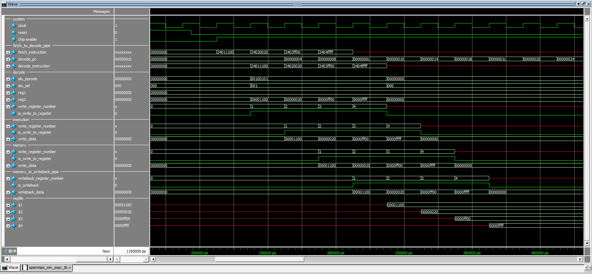

# 第一次用pipeline就上手及CPU第一條指令ori

## 地雷

* 書本提供的toolchain有點**老舊**，直接使用`gcc-mips-linux-gnu`會比較好，`apt-get`輕鬆搞定。
    ```bash
    sudo apt-get install gcc-mips-linux-gnu
    ```

## 模擬結果

* 

## 心得

本來以為在臺南大學學了`VHDL`就足夠派上用場，但發現遠遠不夠。首先是學校用的IDE版本過舊，我使用的Quartus II是10.1版，而學校用的是7.2版。很多功能有巨大的落差，尤其是10.1版本取消了`vector waveform file`，改由`ModelSim`做模擬，需要自己寫testbench，但網路上找到的資料多數是用`Verilog HDL` + `ModelSim`做開發及模擬，在資料稀少的情況下，只好選擇從頭學習`Verilog HDL` + `ModelSim`。