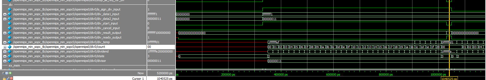
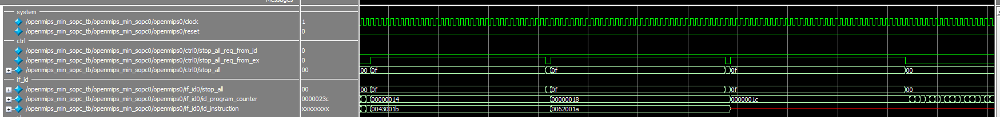

# 給我一個零點，除法可以舉起(raise)一個例外

## 地雷

* 書本上的流程圖講解讓人更不懂，尤其"試商法"更讓人摸不著頭緒，後來發現這本書作者是中國人，"試商法"其實就是以前小學教的直式除法，只是改為二進位版本而已
* testbench要修改時間，原本只跑1000ns實在不夠，改為5000ns才夠跑完三個除法

## 模擬結果

* 除法運算
    確認試商法有沒有正確跑完32個Clock
    
    確認三次除法運算都有暫停管線
    
    確認三次除法的結果是否正確
    