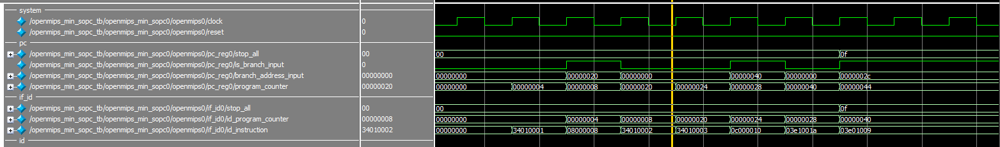
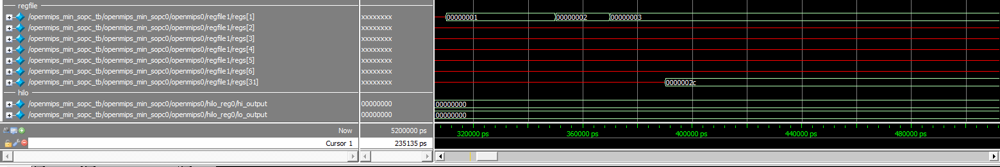
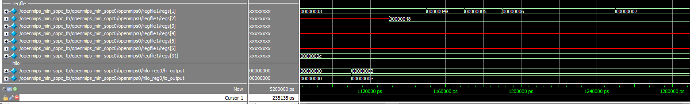
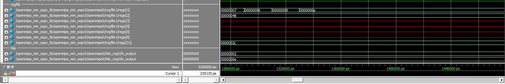
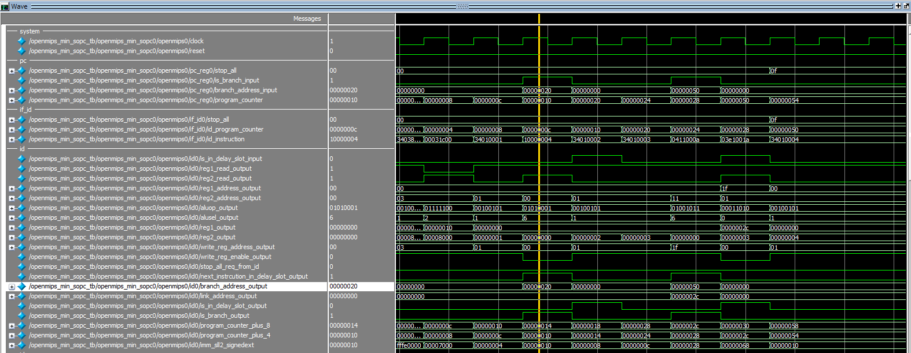
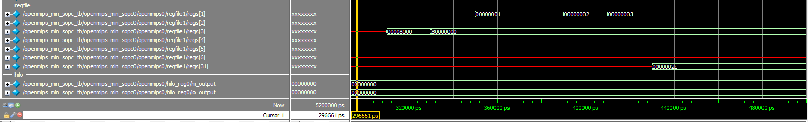
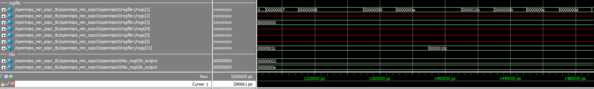
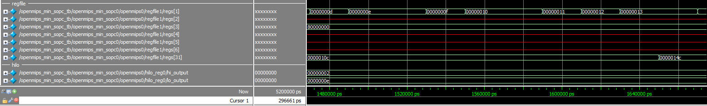
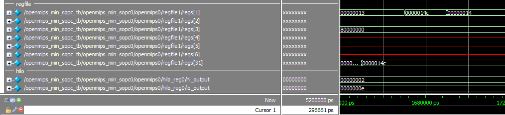

# 跳躍吧！分支

## 地雷

* 《自己動手寫CPU》描述延遲槽(delay slot)的圖容易使人誤會
    ```assembly
    jr $3            # $3 = 0x220
    ori $3, $3, 0x8  # delay slot
    ori $3, $3, 0x9
    # ...
    .org 0x220
    or $4, $9, r0
    ```
    這一段 code 引入 delay slot 的概念後會變成
    ```assembly
    jr $3
    ori $3, $3, 0x8
    or $4, $9, r0
    ```
    作者解釋了`ori $3, $3, 0x8`放入 delay slot 後，可以減少 pipeline 的浪費(空轉)，但沒有解釋`$3`暫存器多做這一步其實不影響後面使用到`$3`的指令，因為**將不影響後續執行的指令放入 delay slot 的責任**是在 **Compiler** 上的。

* 搞了很久卻沒辦法正確用 branch 指令 jump 到特定 address，但 jump 指令卻可以 jump，Debug 好久才發現原來是 branch 在算 target_address 的變數型態給成 `wire`，一條線當然無法表示 32 位元啊XD

## Compiler 的優化的延伸閱讀

* [你所不知道的 C 語言：編譯器和最佳化原理篇](https://hackmd.io/s/Hy72937Me)
* [How A Compiler Works: GNU Toolchain](https://www.slideshare.net/jserv/how-a-compiler-works-gnu-toolchain)

## 模擬結果

### Jump 指令

* 檢查有沒有 Jump
    
* 模擬結果1
    
* 模擬結果2
    
* 模擬結果3
    

### Branch 指令

* 檢查有沒有 Branch
    
* 模擬結果1
    
* 模擬結果2
    
* 模擬結果3
    
* 模擬結果4
    
* 模擬結果5
    