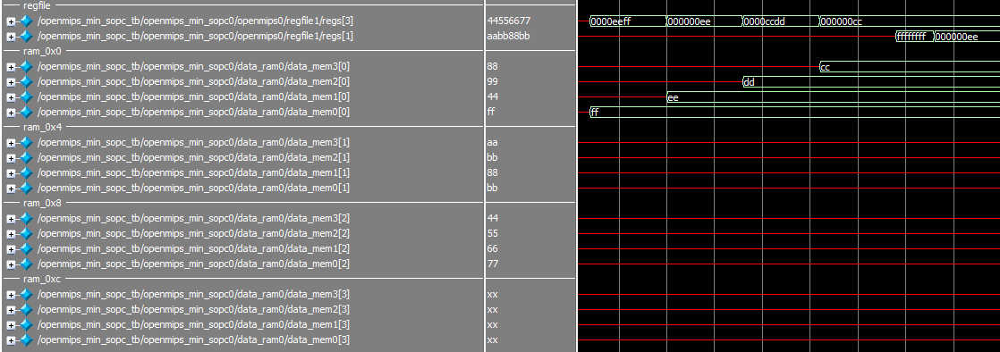
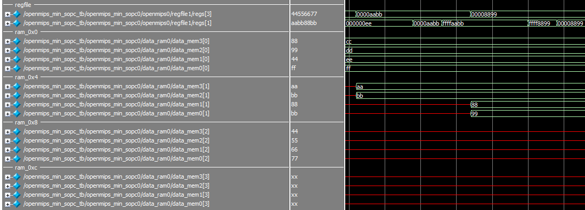
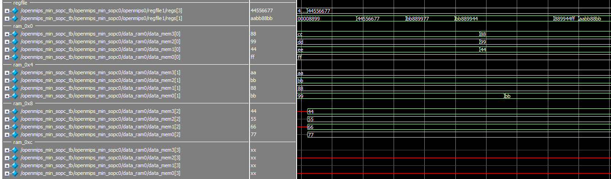

# S/L大法

## 地雷

* 千萬要記住`Load`是在`Memory`階段的事情，跟`Decode`階段差兩個 Clock，一定要暫停`pipeline`，4個小時的人生被浪費了(~~幹~~)

## 模擬結果

* 第一段`sb, lb, lbu`的模擬結果
    
* 第二段`sh, lh, lhu`的模擬結果
    
* 第三段`sw, lw, lwl, lwr`的模擬結果及第四段`swl, swr`的模擬結果
    