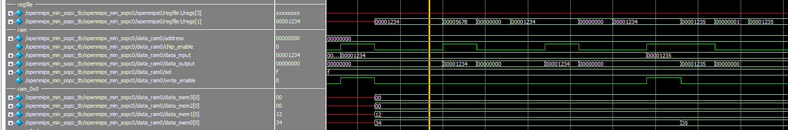
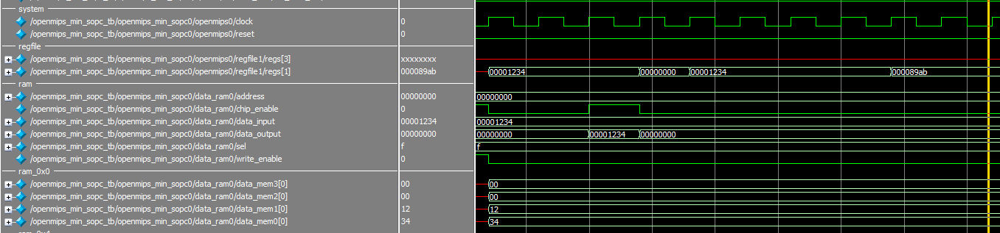

# S/L大法2 - RMW

## 地雷

這次很順利的原因是前面的章節踩了 4 小時的地雷，然後發現作者把相依性問題放在最後一節講，被章節編排雷的外酥內嫩(／‵Д′)／~ ╧╧

## 補充資料

* [Linux 的 Spinlock 在 MIPS 多核处理器中的设计与实现](https://www.ibm.com/developerworks/cn/linux/l-cn-spinlock_mips/index.html)

## 模擬結果

* `ll, sc`指令模擬結果
    
* `load`指令相依問題模擬結果
    