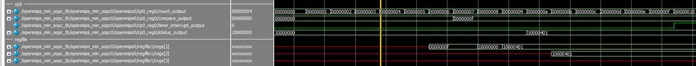

# Coprocessor 是什麼，能吃嗎？

## 地雷

* 這一個章節還好，花比較多時間在找資料，因為以前計算機組織使用的課本，CPU 部分最多只教到 Branch。後面就要放慢速度看 mips 當初定下的規格再寫 code 了，主要卡住的地方在檢查線路有沒有接對

## 模擬結果

* cp0的模擬結果
    1. 可以看到 count 數是跟著 clock 變動的
    2. 可以看到count數到0x6的時候，也就是第二個指令到`pipeline`的 Write Back 階段的時候，cp0 的 compare_output 被改寫
    3. count 數到 0xf 的時候與 compare_output 相等，所以 timer_interrupt_output 從 0 變為 1
    