# 例外與中斷的慘烈修羅場

## 地雷

這一章節真的是慘烈修羅場，因為修改的東西很多，花很多時間 Debug，多數錯誤都是接線的時候接錯或者型態宣告錯誤，少數錯誤則是偷懶複製貼上變數名稱卻沒改好。

## 模擬結果

不想打解說....(倒

### syscall

* 模擬結果
    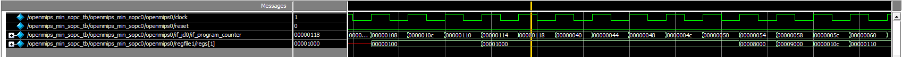
    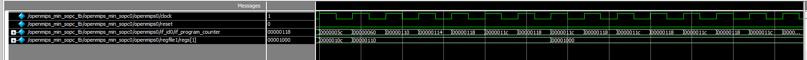

### trap

* 模擬結果
    
    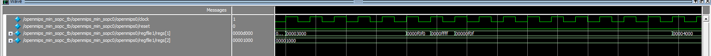
    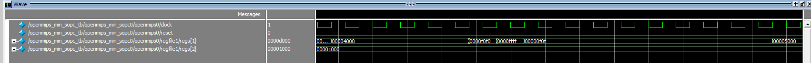
    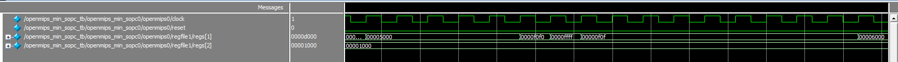
    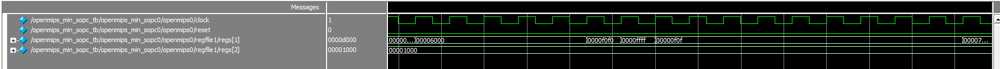
    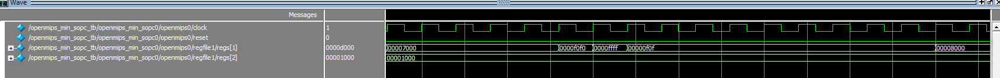
    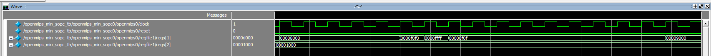
    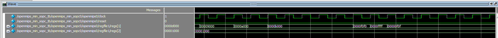
    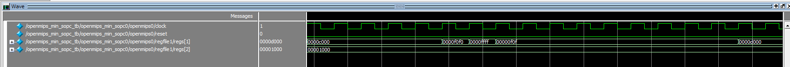
    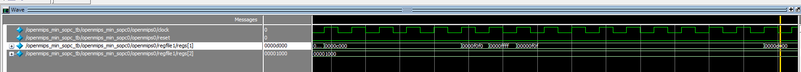

### time interrupt

* 模擬結果
    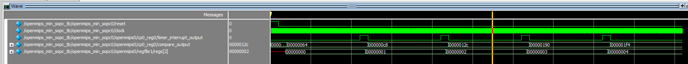